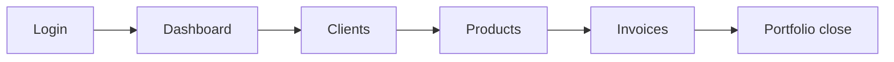

# LedgerLy Demo Guide

This guide defines the recommended local demo flow for LedgerLy as a portfolio project.

## Local URLs

- Frontend: `http://localhost:4200`
- Backend API: `http://localhost:8081/api`

## Demo Credentials

Use the local demo account configured in your database. Do not commit real or local-only credentials.

## Startup

Backend:

```powershell
cd backend
.\mvnw.cmd spring-boot:run
```

Frontend:

```powershell
cd frontend
npm start
```

## Demo Flow



## Recording Script

1. Open `http://localhost:4200/auth/login`.
2. Log in with the demo account.
3. Show the dashboard as the main overview.
4. Open Clients and show that business data loads correctly.
5. Open Products and show the product catalog/listing.
6. Open Invoices and show invoice data.
7. Close by returning to the dashboard or highlighting the full-stack scope.

## Recommended Talking Points

- Angular frontend with protected routes and service-based API access.
- Spring Boot backend exposing REST endpoints.
- MySQL persistence with demo data.
- JWT login flow with role-based access.
- Portfolio-ready local demo, not a production deployment.

## Avoid During Recording

- Google/OAuth login, because local demo values are placeholders.
- Password reset/email flow, because local mail credentials are intentionally not configured.
- Apache/httpd or any service using port `8080`, because LedgerLy uses backend port `8081` for this demo.

## Final Checklist

- Backend running on `8081`.
- Frontend running on `4200`.
- Demo login works.
- Dashboard, Clients, Products and Invoices load.
- `backend/src/main/resources/application.properties` remains local and ignored by Git.
